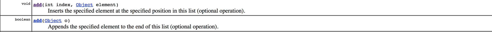
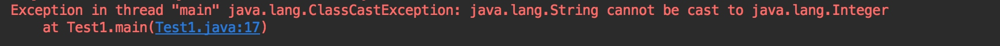

### Java泛型
Java泛型（generics）是JDK 5中引入的一个新特性，允许在定义类和接口的时候使用类型参数（type parameter）。声明的类型参数在使用时用具体的类型来替换。泛型最主要的应用是在JDK 5中的新集合类框架中。泛型的引入可以解决JDK5之前的集合类框架在使用过程中较为容出现的运行时类型转换异常，因为编译器可以在编译时通过类型检查，规避掉一些潜在的风险。

在JDK5之前，使用集合框架时，是没有类型信息的，统一使用Object,我找了一段JDK4 List接口的方法签名

如下是JDK5开始引入泛型，List接口的改动，新的方法签名，引入了类型参数。
```java
boolean add(E e);
```
在JDK5之前，使用集合类时，可以往其中添加任意元素，因为其中的类型是Object，在取出的阶段做强制转换，由此可能引发很多意向不到的运行时强制转换错误,比如以下代码。
```java
public class Test1 {
    public static void main(String[] args) {
        List a = new ArrayList();
        a.add("123");
        a.add(1);             
        // 以上代码可以正常通过编译，其中同时含有了Integer类型和String类型
        for (int i = 0 ; i < a.size(); i++) {
            int result = (Integer)a.get(i);    // 在取出时需要对Object进行强制转型
            System.out.println(result);
        }
    }
}
```
如上代码就会在运行时阶段带来强转异常，在编译时间不能够排查出潜在风险。

如果使用泛型机制，可以在编译期间就检查出List的类型插入的有问题，进行规避，如下代码。
```java
public class Test1 {
    public static void main(String[] args) {
        List<Integer> a = new ArrayList();
        a.add("123");          // 编译不通过
        a.add(1);
    }
}
```
引入泛型后，编译器会在编译时先根据类型参数进行类型检查，杜绝掉一些潜在风险。
为何说是在编译时检查，因为在运行时仍然是可以通过反射，将不符合类型参数的数据插入至list中，如下代码所示。
```java
public class Test1 {
    public static void main(String[] args) throws NoSuchMethodException, InvocationTargetException, IllegalAccessException {
        List<Integer> a = new ArrayList();
        List b = new ArrayList();
        a.getClass().getMethod("add",Object.class).invoke(a,"abc");    
        // 以上代码编译通过，运行通过
    }
}
```
引入泛型的同时，也为了兼容JDK5之前的类库，JDK5开始引入的其实是伪泛型，在生成的Java字节码中是不包含泛型中的类型信息的。使用泛型的时候加上的类型参数，会在编译器在编译的时候去掉。这个过程就称为类型擦除。如在代码中定义的List<String>等类型，在编译后都会变成List，也就自然兼容了JDK5之前的代码。
Java的泛型机制和C++等的泛型机制实现不同，Java的泛型靠的还是类型擦除，目标代码只会生成一份，牺牲的是运行速度。C++的模板会对针对不同的模板参数静态实例化，目标代码体积会稍大一些，运行速度会快很多。
 
进行类型擦除后，类型参数原始类型（raw type）就是擦除去了泛型信息，最后在字节码中的类型变量的真正类型。无论何时定义一个泛型类型，相应的原始类型都会被自动地提供。类型变量被擦除，并使用其限定类型（无限定的变量用Object）替换。
```java
class Pair<T> {
    private T value;
    public T getValue() {
        return value;
    }
    public void setValue(T  value) {
        this.value = value;
    }
} 
  
Pair<T>的原始类型为：
class Pair {
    private Object value;
    public Object getValue() {
        return value;
    }
    public void setValue(Object  value) {
        this.value = value;
    }
}
```
在Pair<T>中，类型擦除，使用Object,其结果就是一个普通的类，如同泛型加入java编程语言之前已经实现的那样。在程序中可以包含不同类型的Pair，如Pair<String>或Pair<Integer>，但是，擦除类型后它们就成为原始的Pair类型了，原始类型都是Object。ArrayList<Integer>被擦除类型后，原始类型也变成了Object，通过反射我们就可以存储字符串了。
 
在调用泛型方法的时候，可以指定泛型，也可以不指定泛型。在不指定泛型的情况下，泛型变量的类型为 该方法中的几种类型的同一个父类的最小级，直到Object。在指定泛型的时候，该方法中的几种类型必须是该泛型实例类型或者其子类。
```java
public class Test1 {
 
   public static void main(String[] args) {
 
      /** 不指定泛型的时候 */
      int i = Test1.add(1, 2); // 这两个参数都是Integer，所以T为Integer类型
      Number f = Test1.add(1, 1.2);// 这两个参数一个是Integer，以风格是Float，所以取同一父类的最小级，为Number
      Object o = Test1.add(1, "asd");// 这两个参数一个是Integer，以风格是Float，所以取同一父类的最小级，为Object
 
      /** 指定泛型的时候 */
      int a = Test1.<Integer> add(1, 2);// 指定了Integer，所以只能为Integer类型或者其子类
      int b = Test1.<Integer> add(1, 2.2);// 编译错误，指定了Integer，不能为Float
      Number c = Test1.<Number> add(1, 2.2); // 指定为Number，所以可以为Integer和Float
   }
 
   // 这是一个简单的泛型方法
   public static <T> T add(T x, T y) {
      return y;
   }
}
```
 因为类型擦除的问题，所有的泛型类型变量最后都会被替换为原始类型，但在泛型的使用中，我们不需要对取出的数据做强制转换。
```java
public class Test1 {
 
    public static void main(String[] args) {
        List<Integer> a = new ArrayList();
        a.add(1);
 
        for (int i = 0 ; i < a.size(); i++) {
            int result = a.get(i);
            System.out.println(result);
        }
    }
}
```
我们从字节码的角度来探索一下。
```java
public static void main(java.lang.String[]);
    Code:
       0: new           #2                  // class java/util/ArrayList
       3: dup
       4: invokespecial #3                  // Method java/util/ArrayList."<init>":()V
       7: astore_1
       8: aload_1
       9: iconst_1
      10: invokestatic  #4                  // Method java/lang/Integer.valueOf:(I)Ljava/lang/Integer;
      13: invokeinterface #5,  2            // InterfaceMethod java/util/List.add:(Ljava/lang/Object;)Z
      18: pop
      19: iconst_0
      20: istore_2
      21: iload_2
      22: aload_1
      23: invokeinterface #6,  1            // InterfaceMethod java/util/List.size:()I
      28: if_icmpge     58
      31: aload_1
      32: iload_2
      33: invokeinterface #7,  2            // InterfaceMethod java/util/List.get:(I)Ljava/lang/Object;
      38: checkcast     #8                  // class java/lang/Integer       这里JVM做了强转
      41: invokevirtual #9                  // Method java/lang/Integer.intValue:()I
      44: istore_3
      45: getstatic     #10                 // Field java/lang/System.out:Ljava/io/PrintStream;
      48: iload_3
      49: invokevirtual #11                 // Method java/io/PrintStream.println:(I)V
      52: iinc          2, 1
      55: goto          21
      58: return
```
在偏移量38的位置可以看到，JVM使用了checkcast指令，说明虽然在编译时进行了类型擦除，但是JVM中仍然保留了类型参数的元信息，在取出时自动进行了强转，这也算是使用泛型的方便之处吧。

在别人的例子有看到说类型擦除和多态的冲突，举了一个例子。
```java
public class Test1 {
 
   public static void main(String[] args) {
      DateInter dateInter = new DateInter();
      dateInter.setValue(new Date());
      dateInter.setValue(new Object());// 编译错误
   }
}
 
class Pair<T> {
   private T value;
 
   public T getValue() {
      return value;
   }
 
   public void setValue(T value) {
      this.value = value;
   }
}
 
class DateInter extends Pair<Date> {
   @Override
   public Date getValue() {
      return super.getValue();
   }
 
   @Override
   public void setValue(Date value) {
      super.setValue(value);
   }
}
```
因为在类型擦除后，父类也就变成了一个普通的类，如下所示
```java
class Pair {
   private Object value;
 
   public Object getValue() {
      return value;
   }
 
   public void setValue(Object value) {
      this.value = value;
   }
}
```
但这样setValue就从重写变成了重载，显然打破了想达到的目的，那么JVM是如何帮助解决这个冲突的呢？答案是 JVM帮我们搭了一个桥，具体我们从字节码的角度再来看看。
```java
class DateInter extends Pair<java.util.Date> {
  DateInter();
    Code:
       0: aload_0
       1: invokespecial #1                  // Method Pair."<init>":()V
       4: return
 
  public java.util.Date getValue();
    Code:
       0: aload_0
       1: invokespecial #2                  // Method Pair.getValue:()Ljava/lang/Object;
       4: checkcast     #3                  // class java/util/Date
       7: areturn
 
  public void setValue(java.util.Date);
    Code:
       0: aload_0
       1: aload_1
       2: invokespecial #4                  // Method Pair.setValue:(Ljava/lang/Object;)V
       5: return
 
  public void setValue(java.lang.Object);
    Code:
       0: aload_0
       1: aload_1
       2: checkcast     #3                  // class java/util/Date
       5: invokevirtual #5                  // Method setValue:(Ljava/util/Date;)V
       8: return
 
  public java.lang.Object getValue();
    Code:
       0: aload_0
       1: invokevirtual #6                  // Method getValue:()Ljava/util/Date;
       4: areturn
}
```
从编译的结果来看，我们本意重写setValue和getValue方法的子类，有4个方法，最后的两个方法，就是编译器自己生成的桥接方法。可以看到桥方法的参数类型都是Object，也就是说，子类中真正覆盖父类两个方法的就是这两个我们看不到的桥方法，打在我们自己定义的setvalue和getValue方法上面的@Oveerride只不过是假象。而桥方法的内部实现，就只是去调用我们自己重写的那两个方法。
 所以，虚拟机巧妙的使用了巧方法，来解决了类型擦除和多态的冲突。
 
最后附上最近在浏览一些别人经验时得到一些tips。
1. 使用JSON串反序列化对象集合时，记得标注对象的class类型，不然会得到一个只有原始类型也就是Object的集合，可能引起类型转换错误，尤其是在服务调用的这种场景下。
2. 重视编译器提出的警告信息。


