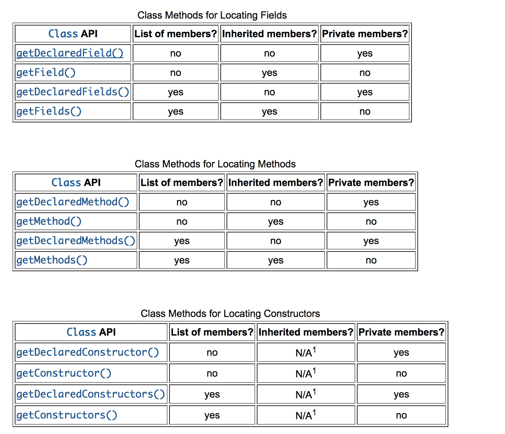

### Java反射机制(一) 
结合Oracle官方通过JDK8编写的反射教程，复习一下反射的知识。结尾篇补一个小例子。
### 主要内容
这次博客的主要内容就是简单介绍反射的概念以及相关获取类信息的反射API。
### 反射的概念
反射是一种在运行时获取以及修改应用行为的一种工具。我个人的理解就是，new是一种正向的操作，知道现有系统中会出现什么。反射就是反着来，不知道系统中可能会需要什么样的类，通过全限定类名的方式，在需要的时候将它反射出来，同时可以通过反射获取类的内部信息。在Java框架的开发中，反射技术运用比较常见。
### 反射的优缺点
#### 优点
1. 强大的扩展性，用户可以通过全限定类名的方式去使用外部定义的类。
2. 帮助IDE开发工具获取用户正在开发的code的信息，提示写出更正确的代码。
3. 利于调试工具获取运行时信息以及测试类框架的使用比如Junit。
#### 缺点
1. 影响性能。 因为反射需要动态的解析类的信息，相比于非反射使用的方式要慢。
2. 对安全环境有要求。 反射需要获取一定的运行时权限，在特定的安全环境下不一定存在。
3. 暴露了内部的封装，可能会引起一些负面效果。比如不该被外部调用的私有方法，通过反射被调用了。

### 通过反射获取类信息
Java中除了基本类型就是引用类型。
boolean，int，long，float等就是基本类型
java.lang.String,Java.io.Serializable就是引用类型
#### 获取java.lang.Class
对于每一种类型，Java提供了java.lang.Class这个类用于获取运行时类的属性和方法信息。同时java.lang.Class也可以用于创建类和对象。
如果是对象类型的话，可以通过其最上层父类Object提供的getClass()方法获取Class类。
```java
"apple".getClass();
```
如果是基本类型或者对于一个普通的类来说，可以使用.class的方式来获取Class类，如下。
```java
int.class;
java.io.PrintStream.class;
```
当获取到类的全限定类名后，可以通过Class.forName创建一个类，如下。
```java
Class c = Class.forName("com.coderising.kailuncen.Main");
```
#### 获取类的相关类信息
以下Api可以用于获取类的相关类信息。
获取类的父类信息:
```java    
Class.getSuperclass()
```
获取类的成员类信息,不包括私有的:
```java
Class.getClasses()
```
获取类的所有成员类信息，包括私有的:
```java
Class.getDeclaredClasses()
```
以下API可以返回声明了这些成员变量的类的Class信息。
```java
Class.getDeclaringClass()
java.lang.reflect.Field.getDeclaringClass()
java.lang.reflect.Method.getDeclaringClass()
java.lang.reflect.Constructor.getDeclaringClass()
```
如果这个类是匿名类的话，可以通过如下API获取包含它的类的类信息。
```java
Class.getEnclosingClass()
```

#### 获取类的修饰符
类在运行期间可以被多种修饰符修饰，如下所示
访问限定符: public, protected, and private。
需要override的修饰符:abstract。
然后static，final，Annotations等。
反射API可以使用如下方法去访问他们。
```java
 Class.getModifiers()
 Class.getAnnotations();
```
#### 获取类的成员信息
在oracle的教程中，整理了三个表格，介绍了如何获取类的成员信息。



