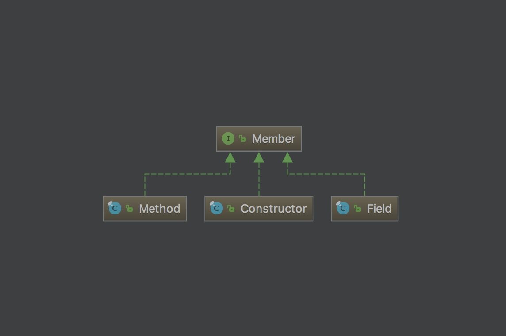

上一篇文章介绍了反射的基本概念以及获取类相关信息的反射API，这一章节主要记录如何对类的成员进行操作的相关反射API。
### 操作类成员的类
反射API中提供了如下接口，用于对类的成员进行操作。
```java
 java.lang.reflect.Member
```
该接口主要有以下三个实现类，用于对类成员中的字段，方法和构造器进行操作。

> Tips: 在Java SE 7的手册中指出，构造器不是类的成员，这和Member的实现类想表达的意思不同。

#### 操作字段
字段拥有类型以及值，使用以下类能够获取类中字段的类型信息，获取字段的值以及对字段进行赋值操作。
```java
 java.lang.reflect.Field
```

#### 操作方法
方法有返回值，参数，并且可能会抛出异常，使用以下类可以获取方法参数以及返回值的类型信息，也可以调用指定对象的方法。
```java
 java.lang.reflect.Method
```
#### 操作构造器
使用如下类可以操作类的构造器，提供与操作method类似的方法，但有以下两点例外，构造器没有有返回值，并且对构造器的调用可以创建指定类的实例。
```java
 java.lang.reflect.Constructor
```

### 实际操作
#### 获取字段类型
```java
public class Main {

	public static String abc = "123";
	private static List<String> a;

	public static void main(String[] args) throws NoSuchFieldException {
		Class c = Main.class;
		Field field = c.getField("abc");
		Field field1 = c.getDeclaredField("a");

		System.out.println(field.getType());
		System.out.println(field.getGenericType());

		System.out.println();

		System.out.println(field1.getType());
		System.out.println(field1.getGenericType());
	}
}
```
如上代码所示，获取对应字段的Field类，具体使用区别在上一张文末介绍了。
getType直接输出这个字段的类类型。
getGenericType直接输出这个字段的类型，如果是泛型字段的话，输出带有泛型实际参数的类型，如果不是泛型则会在内部调用getType。结果如下所示。
```java
class java.lang.String
class java.lang.String

interface java.util.List
java.util.List<java.lang.String>
```

#### 获取字段修饰符
类中字段有许多的修饰符，比如 public，private，transient等，java提供了API获取类的修饰符，不过获取出来的是一个int型数字，好在java提供了Modifier类对获得的整型进行判断，如下代码所示，有兴趣的可以对Modifier源码进行浏览。
```java
public class Main {
    public static int a = 1;
    public static void main(String[] args) throws NoSuchFieldException {
        Class c = Main.class;
        Field field = c.getField("a");
        System.out.println(Modifier.isPublic(field.getModifiers()));
        System.out.println(Modifier.isStatic(field.getModifiers()));
    }
}
```
#### 读写字段值
反射可以对字段进行读写，如下代码所示，可以用过setX和getX方法对字段进行读写，不过要注意读写前后的类型是否匹配，不然会报异常。
```java
    private static int a = 1;

    public static void main(String[] args) throws NoSuchFieldException, IllegalAccessException {
        Class c = Main.class;
        Field field = c.getDeclaredField("a");
        int b = field.getInt(Main.class);
        System.out.println(b);
        field.setInt(Main.class, 2);
        System.out.println(a);
        field.setFloat(Main.class, (float) 1.1);   // 报异常
    }
```

#### 操作方法和构造器
之后操作方法的类是Method，操作构造器的类是Constructor，通过这些API提供的get方法，可以获得方法和构造器的相关信息，因此在笔记里也不再赘述。

#### 构造器创建实例
构造器和方法的反射类不同点在于，Constructor可以创建实例，代码如下所示。
```java
public class Main {

    public Main() {
    }

    public static void main(String[] args) throws IllegalAccessException, InvocationTargetException, InstantiationException {
        Class c = Main.class;
        Constructor[] ctors = c.getConstructors();
        Constructor ctor = null;
        for (int i = 0; i < ctors.length; i++) {
            ctor = ctors[i];
            if (ctor.getGenericParameterTypes().length == 0)     // 需要找到默认构造函数创建实例
                break;
        }

        System.out.println(ctor.newInstance().getClass().getCanonicalName());
    }
}
```
### 结尾
以上就是一些看反射API的一些记录，这个工具本身使用上还是很简单的，但意义还是比较大的，是很多框架存在的基础，下一篇以struts为例子，写一个小demo，展示反射在其中的运用。

